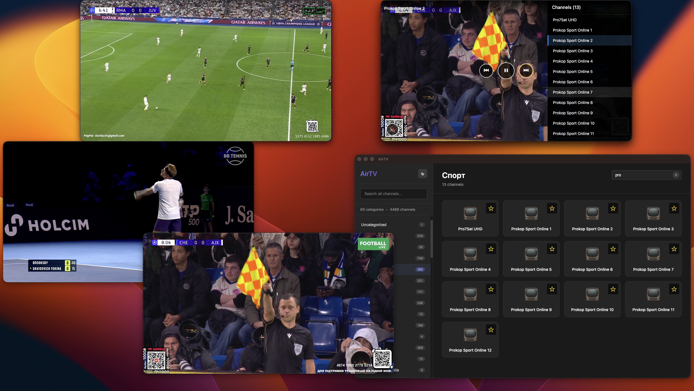

# AirTV - macOS IPTV Player



A beautiful, lightweight IPTV player for macOS with floating, pinnable video windows.

## Download

[](https://github.com/ashuraits/airtv/actions)

**[Download Latest Release](https://github.com/ashuraits/airtv/releases/latest)**

Or browse all [releases](https://github.com/ashuraits/airtv/releases).

### Installation

1. Download the DMG from [latest release](https://github.com/ashuraits/airtv/releases/latest)
2. Open the DMG and **drag AirTV.app to Applications folder**
3. Launch from Applications (don't run from DMG)
4. If macOS shows a warning: Right-click AirTV.app → Open → confirm
5. If still blocked, run: `xattr -c /Applications/AirTV.app`

## Features

- 📺 **M3U Playlist Support** - Import and parse M3U/M3U8 playlist files
- 🎨 **Beautiful UI** - Modern, clean interface with category navigation
- 🔍 **Smart Search** - Quickly find channels across all categories
- 🎬 **Floating Players** - Multiple floating video windows that stay on top
- 📌 **Pin/Unpin** - Toggle always-on-top for any player window
- 🖥️ **Multi-Desktop** - Player windows visible across all macOS desktops
- 💾 **Auto-Save** - Remembers your playlist between sessions
- 🎯 **HLS Streaming** - Built-in HLS.js support for smooth playback

## Technology Stack

- **Electron 38.3.0** - Latest stable version
- **React 19** - Modern UI framework
- **HLS.js** - HTTP Live Streaming support
- **electron-store** - Persistent data storage
- **Webpack** - Module bundling

## Getting Started

### Prerequisites

- macOS 10.13 or later
- Node.js 22.x or later
- npm 10.x or later

### Installation

1. Clone or download this repository
2. Install dependencies:
   ```bash
   npm install
   ```

### Running the App

Development mode:
```bash
npm start
```

Build only:
```bash
npm run build
```

Package for distribution:
```bash
npm run package
```

Create macOS installer:
```bash
npm run make
```

## Usage

### Loading a Playlist

1. Launch AirTV
2. Click "Load Playlist" button
3. Select your `.m3u` or `.m3u8` file
4. Browse channels by category

### Playing a Channel

1. Select a category from the sidebar
2. Use the search box to filter channels (optional)
3. Click any channel card to open a floating player

### Floating Player Controls

- **Drag** - Click and drag the top bar to move the window
- **Pin/Unpin** - Toggle always-on-top behavior
- **Close** - Close the player window
- **Resize** - Drag window edges to resize

### Sample Playlist

A sample playlist file (`sample-playlist.m3u`) is included with demo channels including:
- News: BBC News, CNN, France 24, Sky News
- Sports: Red Bull TV, Olympic Channel
- Documentary: NASA TV, National Geographic
- Business: Bloomberg TV
- Lifestyle: Fashion TV
- Music: XITE
- Kids: Toon Goggles

## Project Structure

```
tvapp/
├── src/
│   ├── index.js              # Main Electron process
│   ├── preload.js            # Preload script (IPC bridge)
│   ├── main/
│   │   └── playlistParser.js # M3U parser
│   └── renderer/
│       ├── index.jsx         # React entry point
│       ├── App.jsx           # Main React component
│       ├── App.css           # Application styles
│       └── index.html        # HTML template
├── dist/                     # Webpack build output
├── webpack.config.js         # Webpack configuration
├── forge.config.js           # Electron Forge config
└── package.json              # Project dependencies
```

## Development

### Watch Mode

For continuous building during development:
```bash
npm run watch
```

Then in another terminal:
```bash
npm start
```

### Tech Details

- **Context Isolation**: Enabled for security
- **IPC Communication**: Secure communication between main and renderer
- **HLS Support**: Automatic fallback to native HLS on Safari
- **Error Handling**: Graceful error display for failed streams
- **Persistent Storage**: electron-store for config persistence

## Keyboard Shortcuts

- **Cmd+Q** - Quit application
- **Cmd+W** - Close current window (floating players only)

## Known Limitations

- Streams must be HLS-compatible (`.m3u8` URLs)
- Some IPTV providers may have geo-restrictions
- DRM-protected content is not supported

## Troubleshooting

### Player shows "Failed to load stream"
- Check if the stream URL is valid and accessible
- Some streams may require VPN or have geo-restrictions
- Verify the stream is HLS-compatible

### App won't start
- Ensure you've run `npm install`
- Check Node.js version compatibility (22.x+)
- Try deleting `node_modules` and reinstalling

### Playlist won't load
- Verify the file is valid M3U/M3U8 format
- Check file permissions
- Ensure channels have proper `#EXTINF` tags

## License

MIT

## Credits

Built with:
- [Electron](https://www.electronjs.org/)
- [React](https://react.dev/)
- [HLS.js](https://github.com/video-dev/hls.js/)
- [electron-store](https://github.com/sindresorhus/electron-store)

---

**AirTV** - Enjoy your favorite IPTV channels on macOS
