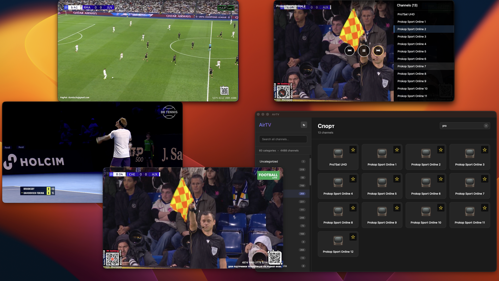

# AirTV - macOS IPTV Player



A modern IPTV player for macOS with multiple source support, smart channel management, and floating video windows.

## Download

[](https://github.com/ashuraits/airtv/actions)

**[Download Latest Release](https://github.com/ashuraits/airtv/releases/latest)**

Or browse all [releases](https://github.com/ashuraits/airtv/releases).

### Installation

1. Download DMG from [latest release](https://github.com/ashuraits/airtv/releases/latest)
2. Open DMG and drag **AirTV.app** to **Applications** folder
3. **First launch:** Right-click AirTV.app → **Open** → Click **Open**
4. If blocked: **System Settings** → **Privacy & Security** → Click **Open Anyway**
5. Enter password and click **Open** to confirm

## Features

### Source Management
- 📁 **Multiple Sources** - M3U File, M3U URL, and Xtream Codes API support
- 🔄 **Auto-Sync** - Automatic playlist updates on app launch
- ✅ **Connection Testing** - Validate sources before adding
- 🔀 **Smart Import** - Create groups from categories or custom mapping
- 📊 **Incremental Sync** - Track added/modified/removed channels

### Channel Organization
- 📂 **Groups** - Organize channels into custom groups
- 🔍 **Fast Search** - Debounced search with virtual scrolling
- ⭐ **Favorites** - Quick access to favorite channels
- 🏷️ **Source Badges** - Visual indicators for each source
- 🗑️ **Bulk Operations** - Select all and delete multiple channels

### Player
- 🎬 **Floating Windows** - Multiple player windows with always-on-top
- 📌 **Pin/Unpin** - Toggle window pinning per player
- 🎯 **HLS & MPEG-TS Streaming** - Automatic format detection with HLS.js and mpegts.js
- 🔊 **Volume Control** - Per-window volume with gradient slider
- ⚡ **Quick Switching** - Change channels without closing player

### User Experience
- 🎨 **Modern UI** - Clean interface with purple/dark theme
- 🔔 **Toast Notifications** - Smooth animated notifications with blur effects
- ⚙️ **Context Menus** - Right-click for group/channel operations
- ✏️ **Inline Editing** - Double-click to rename groups
- 🔄 **Auto-Updates** - Built-in update checker and installer

## Quick Start

1. **Add Source** - Settings → Add Source → Choose File/URL/Xtream
2. **Organize** - Create groups, add channels to favorites
3. **Watch** - Click channel to open floating player
4. **Manage** - Right-click groups for rename/delete, bulk select channels

## Future Plans

See [tasks/](tasks/) folder for upcoming features and improvements.


## Development

### Installation

1. Clone or download this repository
2. Install dependencies:
   ```bash
   npm install
   ```

### Watch Mode

For continuous building during development:
```bash
npm run watch
```

Then in another terminal:
```bash
npm start
```

### Tech Details

- **Context Isolation**: Enabled for security
- **IPC Communication**: Secure communication between main and renderer
- **HLS & MPEG-TS Support**: Auto-detects stream format with native HLS fallback on Safari
- **Error Handling**: Graceful error display for failed streams
- **Persistent Storage**: electron-store for config persistence

## Keyboard Shortcuts

- **Cmd+Q** - Quit application
- **Cmd+W** - Close current window
- **Cmd+A** - Select all (in text fields)
- **Cmd+C/V/X** - Copy/Paste/Cut

## Known Limitations

- DRM-protected content not supported
- Some providers may have geo-restrictions

## License

This project is licensed under the MIT License - see the [LICENSE](LICENSE) file for details.

**Free and Open Source Software** - Feel free to use, modify, and distribute!

## Credits

Built with:
- [Electron](https://www.electronjs.org/)
- [React](https://react.dev/)
- [HLS.js](https://github.com/video-dev/hls.js/)
- [mpegts.js](https://github.com/xqq/mpegts.js)
- [electron-store](https://github.com/sindresorhus/electron-store)

---

**AirTV** - Enjoy your favorite IPTV channels on macOS
