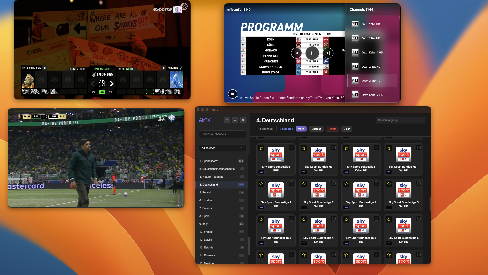

# AirTV - macOS IPTV Player



A beautiful, lightweight IPTV player for macOS with floating, pinnable video windows.

## Download

[](https://github.com/ashuraits/airtv/actions)

**[Download Latest Release](https://github.com/ashuraits/airtv/releases/latest)**

Or browse all [releases](https://github.com/ashuraits/airtv/releases).

### Installation

1. Download DMG from [latest release](https://github.com/ashuraits/airtv/releases/latest)
2. Open DMG and drag **AirTV.app** to **Applications** folder
3. **First launch:** Right-click AirTV.app → **Open** → Click **Open**
4. If blocked: **System Settings** → **Privacy & Security** → Click **Open Anyway**
5. Enter password and click **Open** to confirm

## Features

- 📺 **M3U Playlist Support** - Import and parse M3U/M3U8 playlist files
- 🎨 **Beautiful UI** - Modern, clean interface with category navigation
- 🔍 **Smart Search** - Quickly find channels across and inside categories
- 🎬 **Floating Players** - Multiple floating video windows that stay on top
- 📌 **Pin/Unpin** - Toggle always-on-top for any player window
- 🎯 **HLS Streaming** - Built-in HLS.js support for smooth playback

## Usage

### Loading a Playlist

1. Launch AirTV
2. Click "Load Playlist" button
3. Select your `.m3u` or `.m3u8` file
4. Browse channels by category

### Playing a Channel

1. Select a category from the sidebar
2. Use the search box to filter channels (optional)
3. Click any channel card to open a floating player

### Floating Player Controls

- **Drag** - Click and drag the top bar to move the window
- **Pin/Unpin** - Toggle always-on-top behavior
- **Close** - Close the player window
- **Resize** - Drag window edges to resize
- **Switch channels** - Easily switch channels inside each window

### Sample Playlist

A sample playlist file (`sample-playlist.m3u`) is included with demo channels including:
- News: BBC News, CNN, France 24, Sky News
- Sports: Red Bull TV, Olympic Channel
- Documentary: NASA TV, National Geographic
- Business: Bloomberg TV
- Lifestyle: Fashion TV
- Music: XITE
- Kids: Toon Goggles


## Development

### Installation

1. Clone or download this repository
2. Install dependencies:
   ```bash
   npm install
   ```

### Watch Mode

For continuous building during development:
```bash
npm run watch
```

Then in another terminal:
```bash
npm start
```

### Tech Details

- **Context Isolation**: Enabled for security
- **IPC Communication**: Secure communication between main and renderer
- **HLS Support**: Automatic fallback to native HLS on Safari
- **Error Handling**: Graceful error display for failed streams
- **Persistent Storage**: electron-store for config persistence

## Keyboard Shortcuts

- **Cmd+Q** - Quit application
- **Cmd+W** - Close current window (floating players only)

## Known Limitations

- Streams must be HLS-compatible (`.m3u8` URLs)
- Some IPTV providers may have geo-restrictions
- DRM-protected content is not supported

## Troubleshooting

### Player shows "Failed to load stream"
- Check if the stream URL is valid and accessible
- Some streams may require VPN or have geo-restrictions
- Verify the stream is HLS-compatible

## License

This project is licensed under the MIT License - see the [LICENSE](LICENSE) file for details.

**Free and Open Source Software** - Feel free to use, modify, and distribute!

## Credits

Built with:
- [Electron](https://www.electronjs.org/)
- [React](https://react.dev/)
- [HLS.js](https://github.com/video-dev/hls.js/)
- [electron-store](https://github.com/sindresorhus/electron-store)

---

**AirTV** - Enjoy your favorite IPTV channels on macOS
